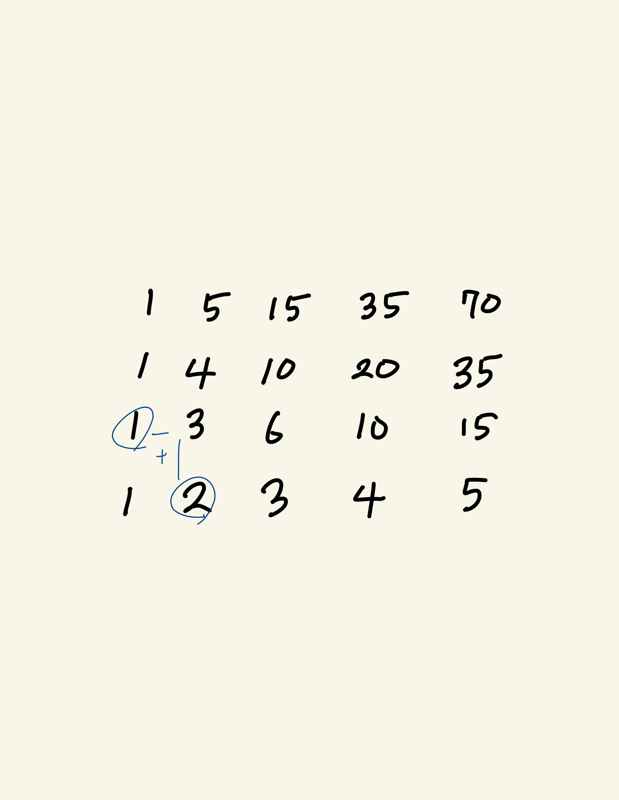

# 1. 카드 구매하기

> 범위가 넓지 않아서 모든 범위를 맵핑해도 되겠지만 그림처럼 규칙을 발견했다.

```n[i][j] = n[i - 1][j] + n[i][j - 1]```
```python
t = int(input())

for _ in range(t):
    k = int(input())
    n = int(input())
    people = [ i for i in range(1, n + 1)]
    
    for __ in range(k):
        for j in range(1, n):
            people[j] += people[j-1]
            
    print(people[-1])
```